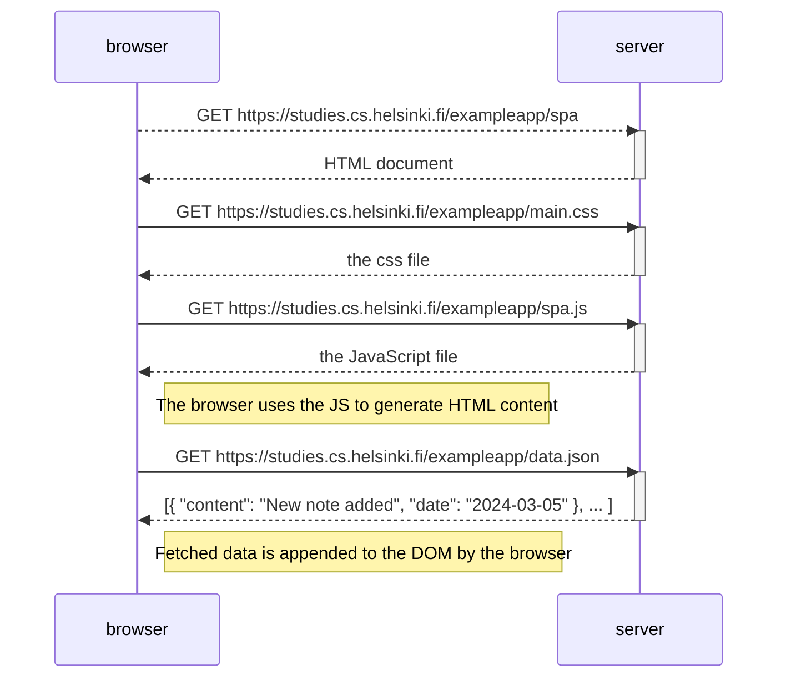

```mermaid
sequenceDiagram
participant browser
participant server

    browser-->>server: GET https://studies.cs.helsinki.fi/exampleapp/spa
    activate server
    server-->>browser: HTML document
    deactivate server

    browser->>server: GET https://studies.cs.helsinki.fi/exampleapp/main.css
    activate server
    server-->>browser: the css file
    deactivate server

    browser->>server: GET https://studies.cs.helsinki.fi/exampleapp/spa.js
    activate server
    server-->>browser: the JavaScript file
    deactivate server

       Note right of browser: The browser uses the JS to generate HTML content

    browser->>server: GET https://studies.cs.helsinki.fi/exampleapp/data.json
    activate server
    server-->>browser: [{ "content": "New note added", "date": "2024-03-05" }, ... ]
    deactivate server

        Note right of browser: Fetched data is appended to the DOM by the browser
```
