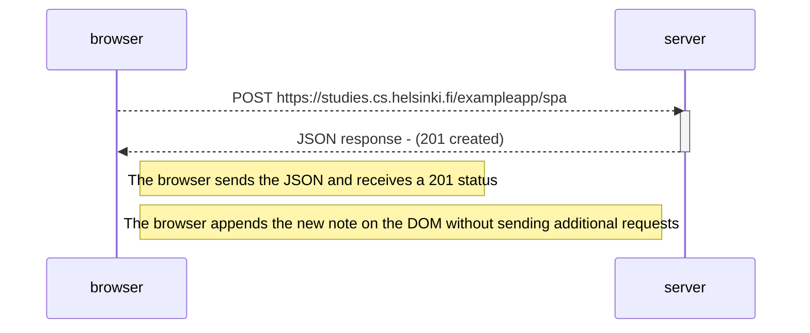

```mermaid
sequenceDiagram
participant browser
participant server

    browser-->>server: POST https://studies.cs.helsinki.fi/exampleapp/spa
    activate server
    server-->>browser: JSON response - (201 created)
    deactivate server

    Note right of browser: The browser sends the JSON and receives a 201 status
    Note right of browser: The browser appends the new note on the DOM without sending additional requests
```
